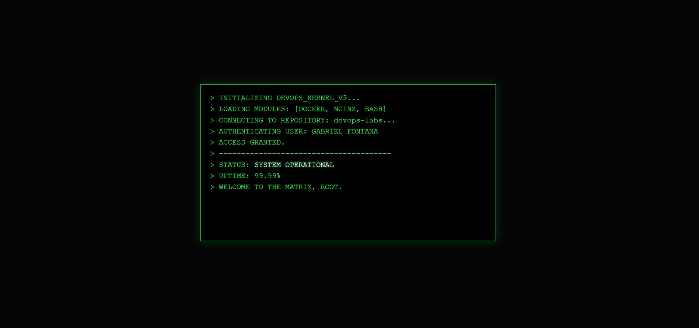

# 🚀 DevOps Laboratory v1.0 — Infrastructure & Automation

<p align="center">
  
  
  
  
</p>

## 📌 Visão Geral do Projeto
Este repositório documenta a implementação de um laboratório de infraestrutura moderna. O foco principal é a **containerização** de serviços e a **automação de rotinas** operacionais, utilizando tecnologias líderes de mercado para garantir escalabilidade e isolamento de processos.

| Componente | Especialidade | Status do Serviço |
| :--- | :--- | :--- |
| **Docker** | Virtualização de Nível de SO | 🟢 Operacional |
| **Nginx** | Servidor Web & Proxy Reverso | 🟢 Ativo |
| **Shell Script** | Automação de Tarefas Críticas | 🟢 Pronto |

---

## 🛠️ Stack Tecnológica

### Infraestrutura e Virtualização
* **Docker Engine:** Utilização de imagens leves baseadas em Alpine Linux para otimização de recursos.
* **Nginx:** Implementação de servidor de alta performance para entrega de conteúdo estático.

### Automação e Gerenciamento
* **Bash Scripting:** Desenvolvimento de scripts para automação de backups e monitoramento de sistema.
* **Git/GitHub:** Fluxo de trabalho baseado em ramificações (branching) e controle de versão profissional.

---

## 📸 Demonstração do Ambiente
Abaixo, a interface de monitoramento rodando via container, validando a integração entre o servidor web e o isolamento de rede do Docker:

<p align="center">
  
  <br>
  <code>Deploy Status: Success | Environment: Production Simulation</code>
</p>

---

## 🚀 Guia de Implantação (Deployment)

Siga as etapas técnicas para replicar este ambiente localmente:

### 1. Provisionamento do Código
```bash
git clone [https://github.com/Gabriel-Fontana/devops-labs.git](https://github.com/Gabriel-Fontana/devops-labs.git)
cd devops-labs
